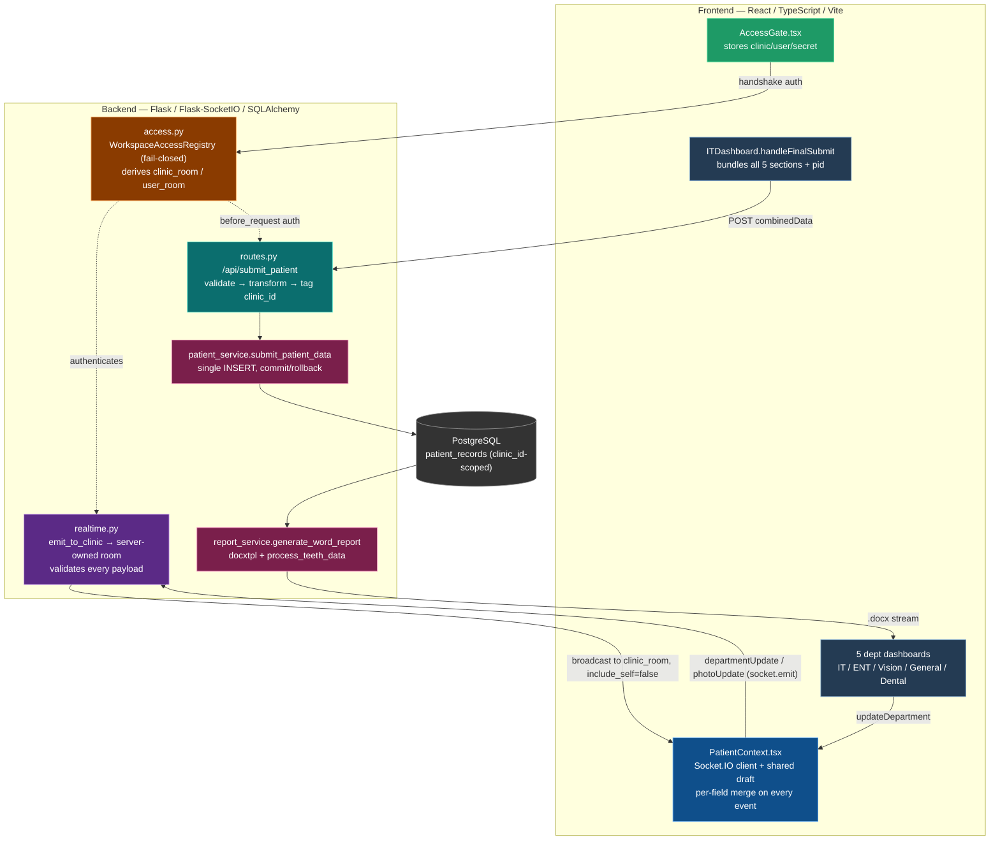

# HealthFlow — current implementation context

> Evidence snapshot: 15 September 2026 IST. Release evidence must map one exact Git commit through GitHub CI, both Fly releases, and post-deploy smoke.
>
> This is the exhaustive, AI-readable map. It is fed to external assistants, so it also explains the trending terms and carries likely interview questions with answers. Current source and executable tests win if an older design note disagrees. A dirty working tree is a candidate, not a release; a configured URL is not proof that the candidate is deployed.

## Product contract

HealthFlow is a synthetic demonstration of one health-camp workflow per clinic. IT intake, ENT, Vision, General, and Dental edit a shared browser-session draft; IT submits the combined record to PostgreSQL; Patients can search and download a DOCX report. Configured clinic/user/secret triples authenticate mutable requests and derive server-owned clinic and user rooms. Stored patient rows and reports are filtered by clinic. The public showcase is a separate, explicit read-only sample: fixed in-memory fixtures, no access code, no socket, disabled browser controls, and server-refused mutations. It is not an EHR, clinical decision system, role-authorized platform, or compliance-ready product, and it must never receive real patient or sensitive data.

## Live deployment (current)

The static frontend `healthflow-abheet19` (`https://healthflow-abheet19.fly.dev`) and API `healthflow-api-abheet19` (`https://healthflow-api-abheet19.fly.dev`) must expose the same 40-character source revision through `/release.json` and `/health`; the current value is release evidence, so it is deliberately not duplicated here. Both use Fly scale-to-zero (`auto_stop_machines`, `min_machines_running = 0`), so the first request after idle cold-starts for a few seconds; verification polls `/health` before proceeding. The frontend build bakes `VITE_API_URL`/`VITE_SOCKET_URL` pointing at the API app. The public sample uses the reserved identity `sample-demo` / `demo-viewer` only when the explicit demo header is present; it never authenticates as a stored clinic. Writable deployment credentials remain server secrets and are not documented. The local Compose default is `synthetic-local-test` and must never equal a deployment secret.

## Redesigned UI — the "glass workspace" (branch `redesign-glass`)

The department forms are no longer default Material UI. The current UI is a hand-built dark-glass design system:

- `App.tsx` renders only the code-split `AccessGate` until a valid `clinic/user/secret` is stored in `sessionStorage` or the user explicitly chooses the isolated read-only sample; then the `WorkspaceApp` chunk loads.
- `AppShell` is the persistent chrome: department sidebar (off-canvas drawer under 880 px), a topbar with the route breadcrumb, a live Socket.IO status pill ("Clinic synced" / "Connecting…" / "Connection lost"), a light/dark toggle, and the **⌘K / Ctrl-K command palette**.
- `CommandPalette` is pure client-side navigation (no API calls until an item is chosen): jump to any department screen, the active in-flight patient draft, or "Lock workspace". Arrow/Enter/Escape handled by a capture-phase document listener.
- `DashboardShell` gives all five departments one glass card, one patient banner, and three distinct empty states (connecting spinner / waiting-for-ID / connection-error). Departments other than IT render their form only once a patient ID exists.
- Custom primitives `Field` and `LabeledSelect` replace raw MUI `TextField`/`Select` (uppercase micro-label, 9 px solid surface, cyan focus ring, optional inline "NA" toggle and end adornments such as the BMI category chip). MUI now appears only in `theme.ts`, the `ThemeProvider` bridge in `WorkspaceApp.tsx`, and the `ToastContext` snackbar.
- Accent system: one clinical emerald/mint hue across three depths (`#5EE6A8 → #3ECF8E → #1E9A66`) over a near-black ground, driven by CSS variables so the MUI theme and the glass chrome share one toggle.

## Architecture and end-to-end flow

```text
access gate -> React/TypeScript/Vite workspace -> shared PatientProvider
  -> Fetch for validation/persistence/reporting
  -> Socket.IO for in-session draft broadcasts
  -> Flask/Flask-SocketIO + SQLAlchemy/Psycopg
  -> PostgreSQL final row -> docxtpl/python-docx report
```

The locked shell is small; the authenticated workspace and each department load lazily. HTTP headers and the Socket.IO handshake carry the same clinic ID, user ID, and secret. The server authenticates the exact configured triple, derives room names itself, and routes draft events only to that clinic. Department saves update the shared in-memory/browser-session draft; only final IT submission creates a database record tagged with the authenticated clinic. Docker Compose is the exact local three-service topology. The frontend and backend deploy as separate Fly apps and must be mapped to one source commit.

## Code map

| Path | Responsibility |
| --- | --- |
| `frontend/src` | access gate, routing/lazy boundaries, PatientProvider, department forms, socket/fetch clients, and report/list UI |
| `backend/server.py; backend/app/access.py; backend/app/realtime.py` | Flask/Socket.IO entry, exact credential registry, server-derived rooms, health, and request boundaries |
| `backend/init_db.py; backend/app/routes.py; backend/app/services` | schema, transaction/persistence, report assembly, and HTTP contracts |
| `backend/template.docx` | DOCX report template |
| `tools` | synthetic recorder, browser verifier, socket probe, evidence checks, and media generation |
| `docker-compose.yml; frontend/Dockerfile; backend/Dockerfile` | reproducible local production-shaped topology |
| `frontend/fly.toml; backend/fly.toml` | separate hosted services |
| `docs/USAGE.md; docs/TESTING.md; .github/workflows/ci.yml` | product usage, canonical acceptance, and automated gate |

## Invariants and trust boundaries

- Use synthetic records only; keep the demonstration/non-clinical disclaimer beside access and workflow surfaces.
- HTTP and Socket.IO must authenticate the same exact clinic/user/secret triple; event payloads must never select their own rooms; logs must not contain secrets, record payloads, or exception text that can embed them.
- Draft broadcasts are not database commits. Only final IT submit persists the complete row transactionally.
- Schema, forms, mapping, validation, report template, report service, and DOCX assertions change together.
- Lock clears this tab's clinic ID, user ID, secret, and draft. Configured identities do not provide SSO, MFA, roles, consent, audit, revocation, retention, or patient-level ownership.
- Clinic rooms prevent cross-clinic event delivery. One clinic still has one active draft, so do not claim simultaneous patient workflows until workflow ownership, durable state, revisions, and reconnect behavior are implemented and tested.

## User workflows to preserve

- Reject incomplete/wrong clinic credentials; unlock the local mutable flow with a configured synthetic identity; lock and verify all tab credentials and draft state are cleared.
- Enter the public read-only sample without a credential; visit all six routes; verify fixed synthetic data, disabled write controls, no mutation requests/socket, and Lock cleanup.
- Create a synthetic ID in IT and verify real Socket.IO delivery to an independent browser context in the same clinic, plus non-delivery to another clinic.
- Complete IT, ENT, Vision, General, and Dental fields including conditional descriptions, N/A switches, BMI, teeth, and synthetic image add/show/delete.
- Verify incomplete-form errors, rapid edit retention, clinic-scoped reset, clinic-filtered persistence/list/report access, Patients search/empty/reload, and DOCX download/content.
- Use the keyboard skip link, mobile drawer, and every navigation CTA at 320 px without page-level overflow.
- Exercise access/list/report failure and recovery, socket disconnect/reconnect, named controls, pressed state, main landmarks, page headings, and minimum target sizes.
- Stop/restart the disposable database and verify bounded degraded `/health` then recovery.

## Concepts this project teaches

| Concept | How it appears here |
| --- | --- |
| SPA code splitting | access shell, workspace, and departments load in separate Vite chunks |
| Shared client state | PatientProvider coordinates a multi-step draft across routes |
| HTTP versus WebSocket | HTTP validates/persists; Socket.IO broadcasts low-latency draft changes |
| Tenant boundary | exact configured credentials derive clinic/user rooms; queries bind the authenticated clinic rather than trusting payload scope |
| Transactions and relational mapping | final submit maps one coherent draft to a PostgreSQL row |
| Document generation | structured data fills a DOCX template with content assertions |
| Stateful deployment | frontend/API/database mappings, migrations, backup/restore, and rollback require coordination |

## CI, packaging, deployment, and rollback

The release gate checks whitespace, builds/lints the Vite frontend, checks Python dependencies and 15 backend tests, starts PostgreSQL/API/frontend through Compose, proves both containers identify the GitHub SHA, records and verifies the complete synthetic workflow, tests 320 px routes and recoverable failures, stops/restarts PostgreSQL, then stops the stack. CI runs that source and Docker workflow; no continuous deployment is configured. Runtime secrets are `DATABASE_URL` plus either the legacy local-demo `HEALTHFLOW_ACCESS_CODE` and fixed default identity, or the multi-identity `HEALTHFLOW_IDENTITIES_JSON` map.

Deploy the backend first, verify database-aware health and schema initialization, then deploy the frontend with matching API/socket URLs. Backend `/health` and frontend `/release.json` must expose the same expected Git SHA. Rehearse migration, backup, restore, and rollback on a database copy; retain the previous images plus restore instructions.

## Current measured evidence

| Result | Evidence |
| --- | --- |
| Exact Compose contract: all five departments, 62 frame pairs, a fresh synthetic row, DOCX content, 14 workflow + 17 navigation + 12 resilience/accessibility checks | `docs/TESTING.md`, CI artifact, and `docs/verification/*.json` |
| Three live Socket.IO clients: same-clinic peer received one event; sender and other clinic received zero | `backend/tests/test_access_and_realtime.py` and release evidence |
| Persisted boundary: each clinic listed only its own synthetic row; cross-clinic report request returned 404 | `backend/tests/test_patient_scope.py` and release evidence |
| Backend regressions: 15/15, including exact credentials, clinic/user rooms, invalid event rejection, isolated-sample behavior, scoped list/report SQL, and DOCX behavior; patched pinned requirements report zero known vulnerabilities under `pip-audit` | `backend/tests`, `backend/requirements.txt`, and per-release audit JSON |
| Public boundary and sample: gate, safe access failure/recovery, all six read-only routes, zero mutation requests, Lock cleanup, matched frontend/API SHA, database health, 12-request bounded probe, 320 px/CLS | `tools/verify-public.mjs` and per-release `public-smoke-results.json` |
| Current production-build Lighthouse: mobile/desktop 100 Performance, Accessibility, Best Practices, and SEO; mobile FCP/LCP 1.1 s, TBT 0 ms, CLS 0 | `docs/verification/lighthouse-mobile.json` and `docs/verification/lighthouse-desktop.json` |

The evidence above belongs to its dated run and exact source. It becomes live evidence only after the same commit passes CI, maps to both releases, and passes post-deploy smoke.

## Open limits

- Configured clinic/user credentials are not SSO/MFA/RBAC/consent/audit/revocation/retention/compliance. Use no real personal or health data.
- Cross-clinic realtime and stored-row access are scoped. A clinic still shares one active draft; there are no workflow/patient rooms, durable draft log, offline replay, ownership checks, or conflict resolution.
- Single-worker Eventlet/Socket.IO topology has no shared broker or demonstrated horizontal behavior; Eventlet migration remains due.
- The idempotent initializer adds `clinic_id` and maps pre-existing rows to `demo`; it is not a migration framework. No tested production data mapping, backup/restore, or disaster-recovery flow exists; local outage recovery is not failover.
- DOCX evidence checks package structure/content, not full Office/LibreOffice pagination or cross-suite rendering.
- Automated accessibility checks cover detectable WCAG failures, keyboard entry, names, pressed state, target floor, landmarks, and 320 px overflow. They are not independent WCAG certification or a complete assistive-technology/browser matrix.

## Trending terms explained (for an external assistant)

- **HealthFlow (the core concept, in plain words)** — HealthFlow is a web app for running one school health-camp checkup as a live, shared workflow. A single child is examined at five stations (IT intake, ENT, Vision, General, Dental); instead of five paper forms reconciled by hand, each station gets its own browser dashboard, all five dashboards edit **one shared draft of that patient in real time**, and when the checkup is complete a single button saves it to a database and produces a downloadable Word report. It is deliberately a **demonstration** of that workflow and the engineering behind it (real-time sync + per-clinic isolation), not a real medical/EHR product, and must only ever hold synthetic data.
- **Multi-tenancy / tenant isolation** — one deployment serves many clinics; each clinic's data and realtime events are walled off from every other. Here the "tenant" is the clinic, and isolation is enforced server-side, not by the client.
- **Server-derived rooms** — a Socket.IO "room" is a named group of connections. HealthFlow derives the room name from the *authenticated* connection, so a malicious client cannot ask to join or broadcast to another clinic's room by editing a payload. Contrast with "client-declared rooms", which are a common tenancy bug.
- **Fail-closed auth** — if credentials are missing, wrong, or the identity map has no exact match, access is denied (not granted with reduced scope). The exact `clinic/user/secret` triple must match a configured identity.
- **CRDT / conflict resolution** — *not* implemented here, and deliberately so. Each clinic has exactly one active draft; there is no offline replay or automatic merge. Do not claim concurrent same-clinic visits until workflow rooms, a durable draft log, and reconnect/merge behavior exist.
- **Optimistic UI / per-field patches** — each field edit is broadcast immediately as a small patch, so peers see changes with low latency, rather than debouncing a whole-object write (which previously risked clobbering rapid edits).
- **HTTP vs WebSocket** — HTTP (request/response) validates, persists, and generates the report; the WebSocket (Socket.IO, persistent, bidirectional) carries low-latency draft broadcasts. They authenticate with the same triple.
- **Transactional write** — the final submit maps a coherent five-section draft to one PostgreSQL row inside a single database transaction, so a partial checkup never persists.
- **Code splitting / lazy chunks** — Vite emits the AccessGate as a small entry bundle and loads MUI, the socket client, and each department as separate chunks on demand, keeping first paint tiny.
- **Scale-to-zero (Fly `auto_stop_machines`)** — idle machines stop and auto-start on the next request; the trade-off is a cold-start delay, which the tooling waits out via `/health`.
- **Server-Timing / correlation ID** — standard response headers (`Server-Timing`, `X-Request-ID`) that let you correlate and time requests in logs without ever logging secrets or patient payloads.
- **`docxtpl` / template rendering** — a Jinja-in-Word templating library; structured record data fills placeholders in `template.docx` to produce the downloadable report.
- **Eventlet** — a green-thread concurrency library Flask-SocketIO uses; the blocking `SELECT 1` health probe runs through `eventlet.tpool` under a timeout so a slow DB cannot hang the worker.
- **Glassmorphism / design system** — the "glass" look (blurred translucent panels) plus reusable primitives (`Field`, `LabeledSelect`, `DashboardShell`) and CSS-variable tokens, so five screens read as one instrument.
- **SPA (Single-Page Application)** — the frontend is one JavaScript app that swaps views client-side (via `react-router-dom`) instead of loading a fresh HTML page per screen; combined with code splitting so each department view downloads on demand.
- **React / component state / Context** — React renders UI from state. `PatientProvider` is a React **Context** that holds the one shared draft and the single Socket.IO connection, so any department component can read/update the same patient without prop-drilling.
- **Socket.IO / WebSocket** — Socket.IO is a library over the WebSocket protocol (with fallbacks) giving a persistent, bidirectional, event-named channel between browser and server; here it carries `departmentUpdate`, `photoUpdate`, `newPatientId`, and `resetPatientData` events. Contrast with HTTP request/response.
- **Flask / Flask-SocketIO** — Flask is the Python web framework serving the HTTP API; Flask-SocketIO adds the Socket.IO server on the same app, run under an Eventlet worker in production.
- **SQLAlchemy / ORM / parameterized SQL** — SQLAlchemy is the Python database toolkit used here mostly via `text()` SQL with **bound parameters** (`:clinic_id`), which prevents SQL injection by never string-concatenating user input into queries.
- **Transaction (`commit`/`rollback`)** — a group of database writes that either all succeed or all undo. The final insert commits once; on any failure it rolls back, so a half-saved checkup can't exist.
- **Vite** — the frontend build tool/dev server; it emits the code-split production chunks (small gate entry, lazy `WorkspaceApp`, lazy department routes) and bakes public `VITE_*` config at build time.
- **CORS (Cross-Origin Resource Sharing)** — browser security rule controlling which web origins may call the API. The backend allow-lists the frontend origins (configurable via `CORS_ORIGINS`) and permits the preflight `OPTIONS` request before authentication so custom headers can be sent.
- **Gunicorn / Nginx** — production process model: Gunicorn runs the Flask/Socket.IO app with one Eventlet worker (see `entrypoint.sh`); Nginx serves the static Vite build. They are separate Fly apps.
- **`sessionStorage` vs `localStorage`** — both are per-browser key/value stores. HealthFlow keeps the credential triple and draft in **`sessionStorage`** (tab-scoped, not shared between tabs/windows, cleared on Lock), which is why two windows act as independent stations.
- **Idempotent initializer** — `init_db.py` can run repeatedly without harm (`CREATE TABLE IF NOT EXISTS`, `ADD COLUMN IF NOT EXISTS`). It is a safe startup step, explicitly **not** a versioned migration framework.
- **BMI (Body Mass Index)** — weight(kg) / height(m)². Computed live in the General dashboard from height+weight and shown with a category chip; a domain example of derived, validated form state.
- **Lighthouse** — Google's automated web-quality lab audit (Performance, Accessibility, Best Practices, SEO). Pinned lab runs score 100×4; it is a lab sample, not field data or a WCAG certification.
- **Cold start / scale-to-zero** — see Scale-to-zero above; the first request after idle waits for a Fly machine to boot, which the tooling absorbs by polling `/health`.

## Likely interview questions and answers

**Q. How do you stop one clinic from seeing another clinic's data or realtime events?**
The server authenticates the exact `clinic/user/secret` triple on both the HTTP request and the Socket.IO handshake, then *derives* the clinic and user room names from that authenticated connection. Event payloads can never name their own room, and every list/report/insert query is bound to the authenticated clinic. Tests prove a same-clinic peer gets an event while the sender and a second clinic get zero, and a cross-clinic report lookup returns 404.

**Q. Why broadcast drafts over a socket instead of just POSTing each change?**
Latency and UX: department stations need to see each other's edits as they happen, which is a persistent bidirectional channel's job. But broadcasts are explicitly *not* commits — they only mutate an in-session shared draft. Durable state is written exactly once, transactionally, on IT's final submit.

**Q. Why per-field patches rather than a debounced full-object save?**
A debounced whole-object write raced with rapid edits and could overwrite or reset fields when an echo landed. Emitting a small patch per field removes that class of bug; the socket echo re-hydrates only the changed field.

**Q. What happens if the database is down?**
`/health` runs a real `SELECT 1` bounded by a two-second Eventlet timeout and returns 503 with generic, non-secret metadata when the DB is unavailable, 200 once it recovers. The app degrades in a bounded way and recovers; there is no failover — that limit is documented.

**Q. Is this HIPAA/EHR-ready?**
No, and the README/UI say so. The credentials are a fail-closed demo boundary, not SSO/MFA/RBAC/consent/audit/retention/encryption governance. It must only ever receive synthetic data.

**Q. How is first paint kept fast with MUI + sockets in the tree?**
The AccessGate is a tiny code-split entry; MUI, the Socket.IO client, and each department load as separate Vite chunks only after authenticated access succeeds or the isolated sample is explicitly selected. Pinned Lighthouse lab runs score 100 across Performance, Accessibility, Best Practices, and SEO on mobile and desktop.

**Q. How do you know a given commit is actually the deployed one?**
Release integrity maps one Git SHA through CI, both Fly releases, and a post-deploy smoke: the frontend publishes the commit at `/release.json` and the API at `/health`, so a mismatched two-service release fails verification.

**Q. What would you build next / what are the known gaps?**
Workflow (per-visit) rooms with ownership so multiple patients per clinic can be in flight; a durable draft/op log with offline replay and reconnect merge; a shared Socket.IO broker to move off the single-worker Eventlet topology; and a real migration/backup/restore/rollback story (the current initializer is idempotent, not a migration framework).

**Q. Walk through exactly what happens when IT clicks Submit.**
The IT client bundles all five section drafts plus `patientId` and `captured_date` into one POST to `/api/submit_patient`. The route checks each of the five departments is present and non-empty, validates that `name` is filled and `dob` parses as a real `YYYY-MM-DD` date (a blank HTML date input would otherwise fail at the Postgres `DATE` column with a raw 500), transforms each section dict into flat DB columns, tags the row with the authenticated `clinic_id`, and `patient_service.submit_patient_data` inserts it inside one transaction. A duplicate `pid` surfaces as a clean 409; any other error rolls back and returns a generic 500.

**Q. How does the client keep fast concurrent edits from clobbering each other without a CRDT?**
Every Socket.IO handler in `PatientContext` uses a functional state update (`setPatientData(prev => …)`) and merges only the keys present in the incoming patch, so a local edit and a remote echo compose instead of overwriting. Field patches (`departmentUpdate`) are also separated from photo events so a large base64 image never rides on a keystroke. This is intentionally *not* a CRDT — there is still one active draft per clinic and no offline replay — but it removes the specific race an earlier debounced whole-object write had.

**Q. Why is BMI computed in an effect that depends only on height and weight?**
The BMI `useEffect` in `GeneralDashboard` writes both `bmi` and `patientData.general`. If it also depended on those, its own write would re-trigger it and loop. Depending only on `[height, weight]` (with an eslint-disable and a comment explaining why) is the correct, deliberate fix — a good example of understanding React's effect dependency model rather than fighting it.

**Q. How is the Word report generated, and how is it resilient?**
`report_service.generate_word_report` loads `template.docx` (a `docxtpl`/Jinja-in-Word template), fills placeholders from the stored row, expands teeth data into per-quadrant selected/remaining lists via `process_teeth_data`, decodes and circle-crops the photo, then renders and streams the `.docx`. A photo that can't be decoded is caught and dropped so the rest of the medical report still renders, and two regression tests assert real content (vision acuity isn't confused with colour-blindness; a corrupt photo still yields a valid document).

**Q. Why keep MUI at all if the UI is a custom design system?**
The department forms are hand-built glass primitives (`Field`, `LabeledSelect`, `DashboardShell`) driven by CSS variables. MUI survives only for the toast snackbar and as a `ThemeProvider` bridge so any residual MUI component follows the same light/dark toggle. Keeping MUI out of the critical first-paint path (it loads inside the lazy `WorkspaceApp` chunk, not the AccessGate) is part of how first paint stays fast.

## Reading order

1. `CONTEXT.md` and `MEMORY.md` — current contract, decisions, evidence, and limits
2. `docs/USAGE.md` — safe end-to-end product flow and recovery
3. `D:\Work\HealthFlow Study Pack\02_HealthFlow_Concepts_From_Zero.md` — HTTP, sockets, React, Flask, SQL, and DOCX foundations
4. `D:\Work\HealthFlow Study Pack\05_HealthFlow_System_Design_React_TypeScript_Flask_Walkthrough.md` — end-to-end code path
5. `frontend/src; backend` — actual client/server implementation
6. `docker-compose.yml; frontend/backend Fly configs; CI` — delivery topology
7. `docs/SANITY.md; docs/TESTING.md; D:\Work\HealthFlow Study Pack\08_TESTING_ARTIFACT.md` — acceptance and evidence

Use `docs/SANITY.md` in the repository, or `09_SANITY_CHECK.md` in the Study Pack, before claiming that a new change works.

## Rules for the next coding agent

1. Keep all demos synthetic and disclaim clinical/compliance use.
2. Preserve exact HTTP/socket credential checks, server-derived clinic/user rooms, clinic-bound queries, and payload-free logs.
3. Treat workflow rooms, ownership, durable drafts, revisions, and reconnect behavior as required before any same-clinic concurrent-visit claim.
4. Change schema/forms/mapping/report/tests atomically and test rollback-safe transactions.
5. Map frontend, API, database migration, source, and rollback separately; do not deploy without authorization.

## Annotated core code + knowledge graph

This section lets an interview-assist AI explain the *actual* HealthFlow source on screen: what each module owns, how data and control flow, and — for the three load-bearing pieces (clinic-scoped Socket.IO broadcast, the transactional final Submit, and the frontend per-field patch merge) — the real code with line-by-line commentary. Everything below quotes real file/function names; nothing is invented.

### Knowledge graph / structure summary

Two independent flows share one authenticated identity (clinic + user + secret). **Fast path** (Socket.IO): every department's keystrokes fan out to the same clinic's other tabs as *draft* patches — never persisted. **Slow path** (HTTP): only IT's final Submit writes one durable row transactionally. The server, not the client payload, decides which room an event reaches.



**One-line-per-file index (the files that matter):**

| File | Owns |
| --- | --- |
| `backend/app/access.py` | `WorkspaceAccessRegistry` — fail-closed credential check (constant-time `hmac.compare_digest`); `WorkspaceIdentity` derives `clinic_room`/`user_room` from the *authenticated* triple, so rooms are server-owned. |
| `backend/app/realtime.py` | Socket.IO handlers; `emit_to_clinic` sends only to `identity.clinic_room`; every event payload is shape-validated; `departmentUpdate`/`photoUpdate` use `include_self=False`. |
| `backend/server.py` | App factory: eventlet monkey-patch, CORS/Socket.IO origins, `before_request` HTTP auth (`protect_patient_api`), `/health` DB probe in eventlet tpool, idempotent `init_db()` at import. |
| `backend/app/routes.py` | HTTP contracts; `/api/submit_patient` validates 5 depts + `dob`, transforms sections to flat columns, tags `clinic_id`; `/api/generate_report` streams the DOCX. |
| `backend/app/services/patient_service.py` | DB access; `submit_patient_data` = one parameterized INSERT with `commit()`/`rollback()`; `create_new_patient_id` retries for a unique PID. |
| `backend/app/services/report_service.py` | `ReportService.generate_word_report` fills `template.docx` via docxtpl. |
| `backend/app/utils.py` | `transform_*` (section dict → DB columns), `translate_record` (row → frontend), `process_teeth_data`, `validate_fields`. |
| `backend/init_db.py` | Idempotent schema: `CREATE TABLE IF NOT EXISTS patient_records` + additive `ADD COLUMN IF NOT EXISTS clinic_id`. |
| `frontend/src/context/PatientContext.tsx` | Socket.IO client + the shared in-session draft; per-field functional-merge on every inbound event; `updateDepartment` emits patches (photo split from field patches). |
| `frontend/src/pages/ITDashboard.tsx` | `handleFinalSubmit` — gates on all 5 sections, bundles `combinedData`, POSTs to `/api/submit_patient`. |
| `frontend/src/config/api.ts` | `getWorkspaceCredentials`, `SOCKET_URL`, `apiFetch` (adds the `X-HealthFlow-*` headers). |

### Excerpt 1 — clinic-scoped Socket.IO broadcast (`backend/app/realtime.py`)

The security crux of the fast path: a connected client can send any payload, but **it can never choose whose room the event lands in** — the room is read from the server-side identity keyed on the socket's `request.sid`.

```python
def emit_to_clinic(event, payload=None, *, include_self=True):
    identity = current_identity()                 # identities[request.sid] — set at connect, not from the payload
    if identity is None:
        return {"error": "Authenticated realtime session required."}  # fail closed: no identity ⇒ nothing is emitted
    emit(event, payload, to=identity.clinic_room, # 'to' is ALWAYS the server-derived room "clinic:<id>"…
         include_self=include_self)               # …the client's message body has no say in the destination
    return {"ok": True}                            # ack back to just the sender (Socket.IO callback)

@socketio.on("connect")
def connect(auth):
    identity = access_registry.authenticate(       # verify the exact clinic/user/secret triple in the handshake
        auth.get("accessCode"), auth.get("clinicId"), auth.get("userId"))
    if identity is None:
        return False                               # reject the socket entirely — no room, no events
    identities[request.sid] = identity             # bind identity to THIS connection id
    join_room(identity.clinic_room)                # membership is derived, not requested

@socketio.on("departmentUpdate")
def department_update(data):
    if not isinstance(data, dict) or not data or not set(data).issubset(_DEPARTMENTS):
        return {"error": "Invalid department update."}   # reject unknown keys before broadcasting
    if any(v is not None and not isinstance(v, dict) for v in data.values()):
        return {"error": "Department values must be objects or null."}  # null = reset; dict = patch
    return emit_to_clinic("departmentUpdate", data, include_self=False)  # echo to peers only, never back to sender
```

*What an interviewer might ask:* **"How do you stop one clinic's draft edits leaking into another clinic over the socket?"** — Rooms are never taken from client input. At `connect` the handshake is authenticated and the socket is bound (`identities[request.sid] = identity`) and `join_room`-ed to `clinic:<id>`; every broadcast goes `to=identity.clinic_room`. Even a malicious client that forges a `clinicId` in an event body is ignored, because `emit_to_clinic` reads the room from the server-side identity, not the payload. `include_self=False` prevents a client's own echo from clobbering its newer local state. Trade-off: identity lives in a per-process `dict`, so this correctness holds only on a single Eventlet worker; horizontal scale-out needs a shared Socket.IO broker (a documented gap).

### Excerpt 2 — the transactional final Submit (`backend/app/services/patient_service.py`)

The slow path's durability crux. Draft broadcasts are never written; only this function persists, and it is all-or-nothing.

```python
def submit_patient_data(db: Session, flat_data: dict):
    try:
        columns = ", ".join(flat_data.keys())              # column list built from the flattened dict…
        values = ", ".join([":"+k for k in flat_data.keys()])  # …matching :named bind params (never string-interpolated values)
        query = text(f"INSERT INTO patient_records ({columns}) VALUES ({values})")
        db.execute(query, flat_data)                       # values passed separately ⇒ parameterized, injection-safe
        db.commit()                                        # one transaction: the whole cross-department row or nothing
        return True
    except Exception as error:
        db.rollback()                                      # any failure (e.g. duplicate pid) leaves NO partial row
        logging.error("Patient insert failed error_type=%s", type(error).__name__)  # log the TYPE only — never the patient payload
        raise                                              # re-raise so routes.py maps IntegrityError→409, else→500
```

*What an interviewer might ask:* **"Why build the INSERT string from `flat_data.keys()` — isn't that SQL injection?"** — No. Only the *column names* (fixed, code-controlled keys produced by the `transform_*` functions) are interpolated; every *value* is a `:named` bind parameter passed as the second arg to `db.execute`, so user data is never concatenated into SQL. The single `commit()`/`rollback()` makes the five-section record atomic — a duplicate `pid` raises `IntegrityError`, the row is rolled back, and `routes.py` turns it into a clean `409` instead of a half-written patient. Complexity is O(number of columns) for one round-trip; the real trade-off is that dynamic column lists must stay in lockstep with the schema and the `transform_*` mappers (the "change schema/forms/mapping/report/tests atomically" invariant).

### Excerpt 3 — the frontend per-field patch merge (`frontend/src/context/PatientContext.tsx`)

The concurrency crux without a CRDT: inbound socket events are merged field-by-field via a functional state update, so a local edit and a remote echo compose instead of overwriting.

```js
newSocket.on('departmentUpdate', (updatedData) => {
  setPatientData(prev => {                         // functional update: read the LATEST state, not a stale closure
    const result = { ...prev, timestamp: Date.now() };
    Object.entries(updatedData).forEach(([dept, data]) => {   // walk only the departments present in THIS patch
      if (data === undefined || data === null) {
        result[dept] = undefined;                  // null/undefined = the peer reset that section
      } else {
        const prevDeptData = prev[dept] || {};
        // Standard merge: keep every existing field, overlay only the keys in the incoming patch
        result[dept] = {
          ...(typeof prevDeptData === 'object' ? prevDeptData : {}),  // fields the peer didn't touch survive
          ...(typeof data === 'object' ? data : {})                  // incoming keys win for the fields they carry
        };
      }
    });
    return result;                                 // a partial patch never clobbers untouched fields
  });
});
```

(Dental `tooth_cavity_permanent` / `tooth_cavity_primary` get an extra explicit merge branch in the same handler so the tooth-selection maps are replaced wholesale rather than shallow-spread. On the send side, `updateDepartment` splits the large base64 `photo` into `photoUpdate`/`photoDelete` events so an image never rides on a keystroke's `departmentUpdate`.)

*What an interviewer might ask:* **"Two stations edit the same patient at once — how do you avoid one wiping the other, and why isn't this a CRDT?"** — Two mechanisms. (1) `setPatientData(prev => …)` is a *functional* update, so each event merges against React's freshest state rather than a value captured when the listener was registered — this removes the lost-update race an earlier debounced whole-object write had. (2) The merge is shallow-per-department and only over the keys actually present in the patch, so fields the peer didn't send are preserved. It is deliberately *not* a CRDT: there's still one active draft per clinic, no offline op-log, and no reconnect replay, so concurrent conflicting writes to the *same field* are last-writer-wins by arrival order. That's the honest boundary — good enough for one in-flight patient per clinic, and the documented next step (workflow rooms + durable op-log) is what a true multi-patient concurrent design would need.
