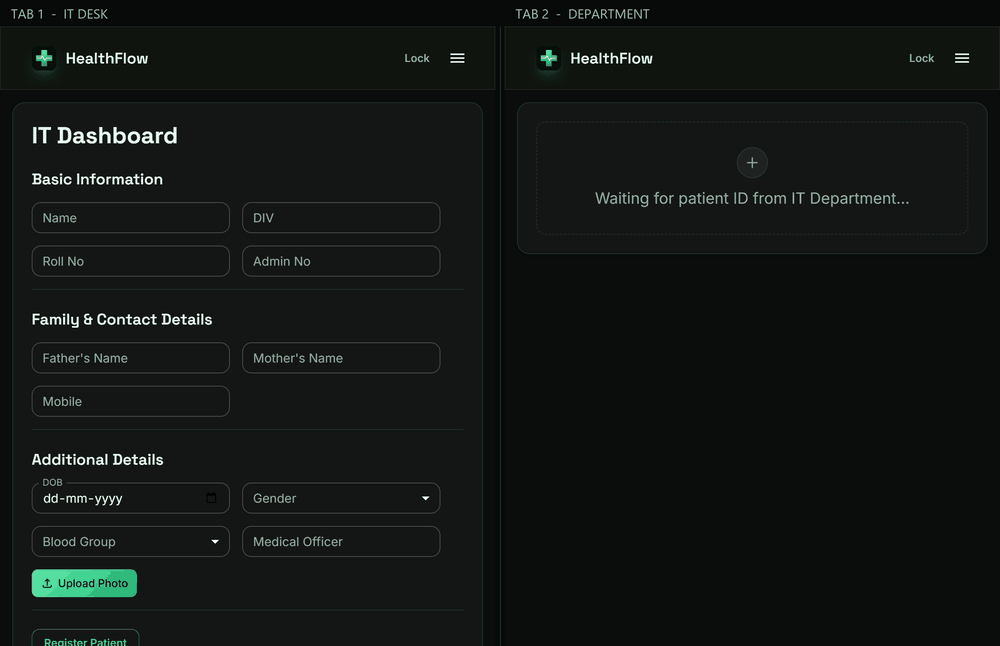
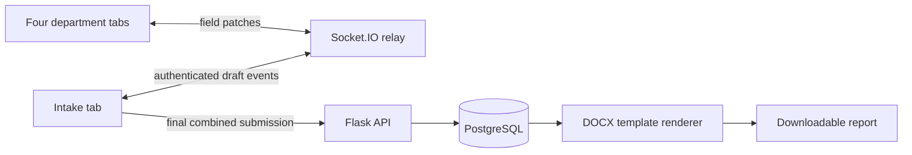
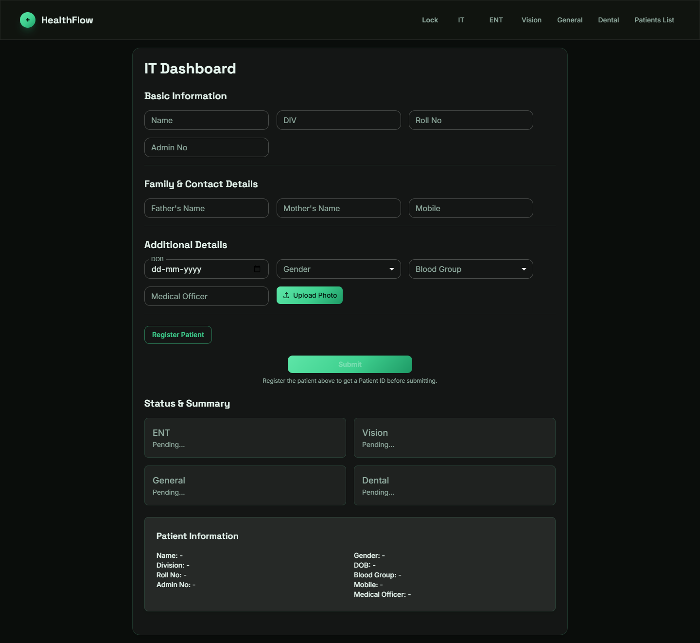
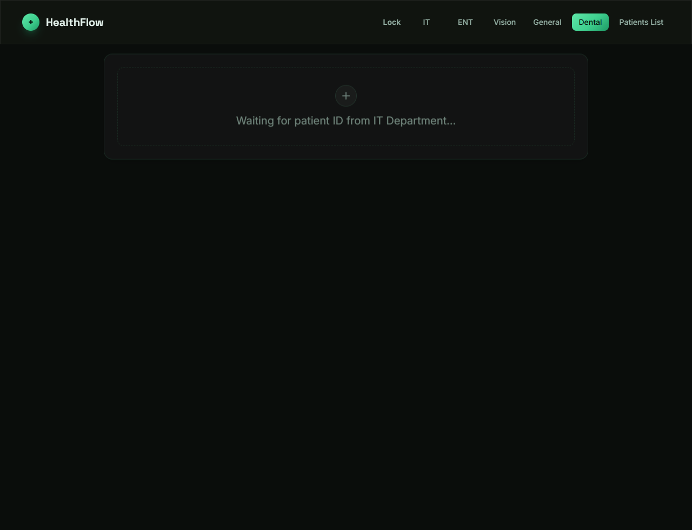
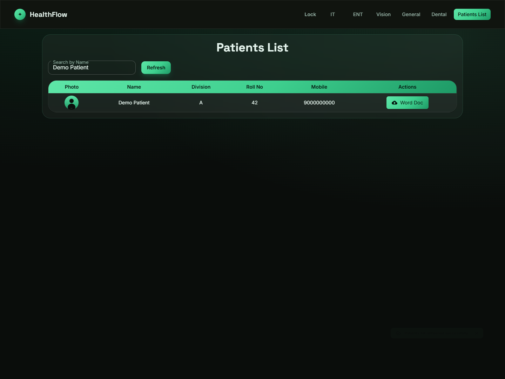
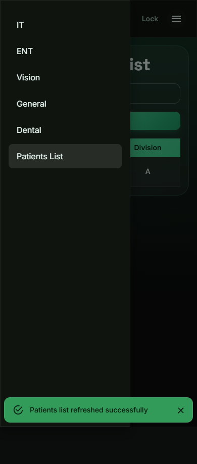

> [!IMPORTANT]
> **Demonstration workspace only.** The deployed instance now requires a workspace access code before its API, realtime channel, or dashboard can be used. It is for synthetic demonstration records only: do **not** enter real patient, school, employee, or health information. A shared access code is a useful personal-demo gate, not the authentication, role controls, consent, audit trail, retention policy, encryption program, and compliance review required for a clinical system.
<div align="center">

<br>

# 🩺 &nbsp;H E A L T H F L O W

### **One patient, five departments, one report.**

A clinic health-checkup workflow — IT intake, ENT, Vision, General and Dental — collected on<br>
five live dashboards and stitched into a single formatted `.docx` report.

<br>


<br>

<sub>A personal project by <b><a href="https://github.com/abheet19">Abheet</a></b>.</sub>

<br><br>



<sub>Two independent browser contexts, recorded against an isolated local PostgreSQL stack: IT registers a patient, the department<br>
tab picks them up over the WebSocket, all four departments report in, and the <code>.docx</code> falls out the end.</sub>

</div>

> [!NOTE]
> **Live at [healthflow-abheet19.fly.dev](https://healthflow-abheet19.fly.dev).** Frontend, backend
> and Postgres are all deployed on Fly.io — see [Running it locally](#-running-it-locally) if you'd
> rather run it yourself.

---

## What this does

A clinic checkup normally means five departments filling out paper forms for the same patient and
someone reconciling all of it by hand afterwards. HealthFlow puts each department on its own
dashboard — IT registers the patient and takes their photo, ENT/Vision/General/Dental each fill in
their own exam fields — all reading and writing the same in-flight patient record over a WebSocket,
so every tab stays in sync as data comes in. Once every department has submitted, IT's final submit
bundles all five sections into one call, the backend stores it in Postgres, and a formatted `.docx`
report is generated from a template and made available for download from the patients list.

---




Draft changes synchronize before the final database commit. The current workspace has one shared active workflow; see [testing and limitations](docs/TESTING.md) before assuming multi-patient isolation.

## 🛠 Tech stack

| Layer | Technology |
|---|---|
| **Frontend** | React 18, TypeScript, Vite, Tailwind CSS, MUI (Material UI), Socket.IO client |
| **Backend** | Python 3.12, Flask, Flask-SocketIO, SQLAlchemy, python-docx |
| **Database** | PostgreSQL |
| **Containerization** | Docker, Docker Compose (frontend + backend + PostgreSQL 17) |
| **Operations** | Fly.io, GitHub Actions CI, database-aware health check, request IDs and Server-Timing |

---

## 🎨 Design

Dark glass throughout, with its own accent family rather than a generic dashboard blue: a
**clinical emerald/mint gradient** (`#5EE6A8 → #3ECF8E → #1E9A66`) over a near-black ground
(`#0A0D0B`), with soft mint-tinted glass panels and `#E6F5EE` body text. One green hue carried
across three depths — light highlight, mid accent, deep forest edge — rather than a second hue
bolted on, so the five dashboards read as one clinical instrument instead of five separate forms.

A shared `DashboardShell` component carries that look consistently across all five department
pages: the same glass card, the same "waiting for a patient ID" empty state, the same patient
header, so a style change only has to happen in one place.

---

## 🖼 Screenshots

Captured from the current application with synthetic records on an isolated local PostgreSQL stack.

| IT dashboard (patient intake) | Dental dashboard (shared-workflow waiting state) |
|---|---|
|  |  |



<details>
<summary>Mobile navigation (390 px verified viewport)</summary>



</details>

---

## Key features

- **Real-time sync across dashboards** — a Socket.IO connection keeps every department's view of a
  patient record current as other departments submit data.
- **Five department dashboards** — IT, ENT, Vision, General and Dental, each with its own required
  fields and validation, sharing one patient context.
- **Automated `.docx` report generation** — once a patient's record is complete, a formatted Word
  report is generated from a template and downloadable from the patients list.
- **Consistent feedback UX** — loading states while data is fetched, empty-state messaging when a
  department has no patients yet, and success/error toasts surfaced consistently across all five
  dashboards.
- **Bounded browser payload** — department pages are loaded as route chunks, so opening one station
  does not download every other form up front.
- **Operational signals without patient payloads** — API responses carry a correlation ID and
  `Server-Timing`; logs record only method, path, status and duration. `/health` checks PostgreSQL
  before reporting ready.

---

## 🚀 Running it locally

**With Docker (recommended — brings up Postgres too):**

```bash
git clone https://github.com/abheet19/HealthFlow.git
cd HealthFlow
cp .env.example .env
docker compose up --build
```

Open `http://127.0.0.1:3000` and use the local synthetic code
`synthetic-local-test`. Override `HEALTHFLOW_DB_PASSWORD` and
`HEALTHFLOW_ACCESS_CODE` in an untracked `.env` when you need different local
values. Never reuse deployment secrets or real records in this demo stack.

**Without Docker:**

```bash
# Backend
cd backend
pip install -r requirements.txt
# .env with POSTGRES_USER / POSTGRES_PASSWORD / POSTGRES_HOST / POSTGRES_PORT / POSTGRES_DB
python init_db.py
# Set HEALTHFLOW_ACCESS_CODE and CORS_ORIGINS for your local frontend
python server.py

# Frontend, in a second terminal
cd frontend
npm ci
# Set VITE_API_URL and VITE_SOCKET_URL to your local backend
npm run dev
```

---

## Project layout

```
HealthFlow/
├── .github/    Source checks and full synthetic Docker acceptance in CI
├── backend/     Flask API, Socket.IO server, docx report generation
├── frontend/    React + TypeScript + Vite + Tailwind + MUI
├── tools/       Demo recorder (not part of the app build)
└── docker-compose.yml
```

---

## 🎬 Regenerating the demo GIF

The GIF at the top is a Playwright script driving two independent browser
contexts against an isolated local stack, so the right-hand pane only ever changes because something
actually arrived over the WebSocket. Re-record it whenever the UI changes:

```bash
cd tools
npm install
npx playwright install chromium
BASE_URL=http://127.0.0.1:3000 API_URL=http://127.0.0.1:5000 node record-demo.mjs
python build-gif.py # composites the panes -> docs/demo/healthflow-demo.gif
BASE_URL=http://127.0.0.1:3000 npm run verify
```

`record-demo.mjs` should run against a local stack and registers a synthetic patient named
**Demo Patient** and runs the full five-department flow. `build-gif.py` takes `--width`, `--colors`
and `--tempo` if you need to trade size against length. The scripts use local Chrome on Windows,
Playwright Chromium in Linux CI, or the browser at `CHROME_PATH` when set.

> The recorder rejects remote frontend URLs. Use a disposable local database and never record against deployed patient records.

The latest measured checks, exact commands, deployment model and known limits
are in [the testing artifact](docs/TESTING.md). The current build keeps the locked gate at 148.12 kB (48.06 kB gzip), then loads the authenticated
workspace as a 242.39 kB route chunk (79.73 kB gzip) and the selected department on demand. The deployed Lighthouse lab run measured 88 mobile / 95 desktop
performance and 100 Accessibility, Best Practices and SEO on both profiles; `npm audit --omit=dev`
reported zero known production dependency vulnerabilities in that run.
