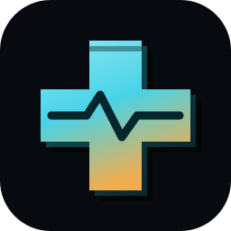
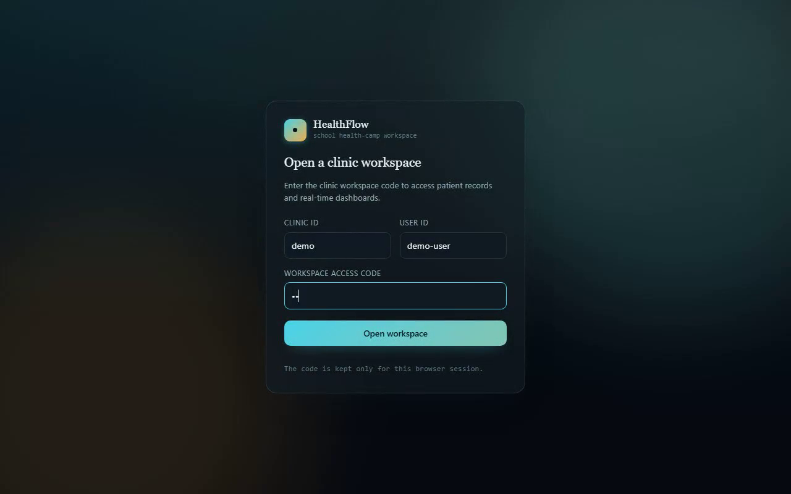
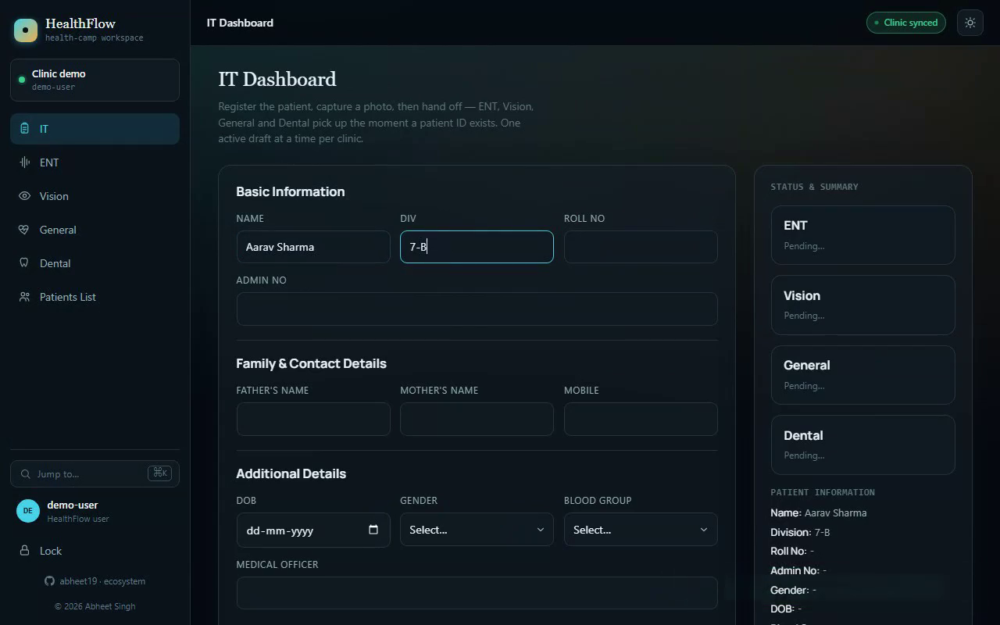
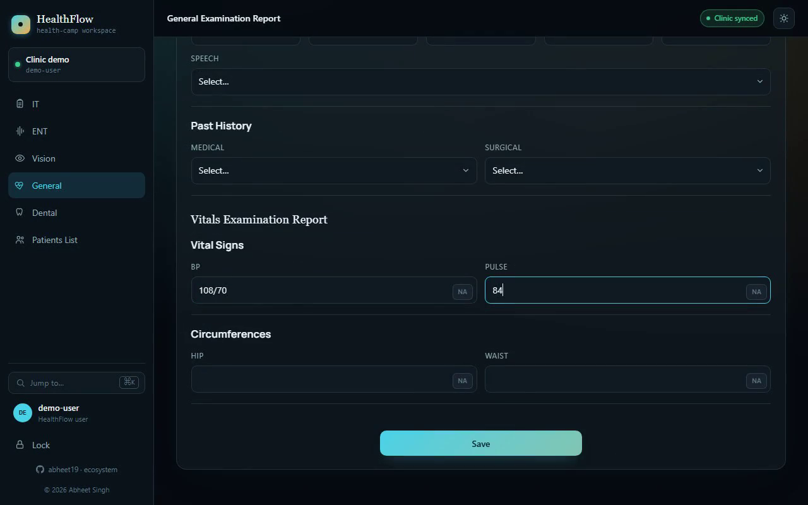
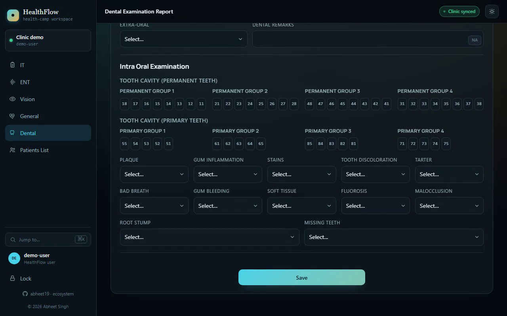
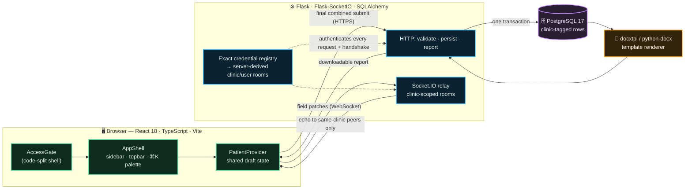

> [!IMPORTANT]
> **Demonstration workspace only.** The public site opens an isolated, read-only sample without credentials. HealthFlow's writable local flow validates a configured clinic ID, user ID, and secret before its API or realtime channel can be used, then scopes stored rows, reports, and Socket.IO events to the authenticated clinic. Use **synthetic** records only: do **not** enter real patient, school, employee, or health information. These controls are not SSO, MFA, roles, consent, audit, retention, an encryption program, or a clinical compliance review.

<div align="center">

<br>



# 🩺 &nbsp;H E A L T H F L O W

### **One patient. Five departments. One report. In real time.**

A school health-camp checkup runs across five stations — IT intake, ENT, Vision, General and Dental.
HealthFlow puts each on its own **glass dashboard**, keeps them in lock-step over a **clinic-scoped
WebSocket**, and stitches the finished checkup into a single formatted `.docx` report — no paper, no
manual reconciliation.

<br>


<br>


<br>

### ▶ &nbsp;[**Try the live demo →**](https://healthflow-abheet19.fly.dev)

<sub>Choose <b>View read-only demo</b> &nbsp;•&nbsp; no credential required &nbsp;•&nbsp; fixed synthetic data only</sub>

<br>


<sub><b>Full-workflow demonstration.</b> The reel shows the authenticated synthetic workflow: register a patient,
jump with the ⌘K command palette, fill the dense vitals surface, and switch dashboards. The public entry shown above is read-only.<br>
▶ <a href="docs/media/healthflow-reel.mp4">Watch the crisp 60&nbsp;fps MP4</a> · <sub>A personal project by <b><a href="https://github.com/abheet19">Abheet</a></b>.</sub></sub>

</div>

---

## 💡 The problem

A clinic checkup normally means five departments filling out paper forms for the same patient and
someone reconciling all of it by hand afterwards — slow, error-prone, and impossible to hand off
mid-visit.

## ✅ What HealthFlow does

Each department gets its own dashboard that reads and writes the clinic's **current in-flight record**
over a clinic-scoped Socket.IO room, so every authenticated tab in that clinic stays in sync as the
patient moves station to station. IT registers the patient and takes their photo; ENT / Vision /
General / Dental each fill their own exam fields; the IT desk's status tiles light up as each
department reports in. Once all five sections validate, IT's **final submit** bundles them into one
call, the backend persists it to PostgreSQL in a single transaction, and a formatted `.docx` report
is generated from a template and offered from the patients list.

---

## 🎬 Demo

| The clinic AccessGate | IT intake + live status tiles |
|---|---|
|  |  |

| General — dense vitals surface | Dental — permanent/primary tooth grid |
|---|---|
|  |  |

**Walk the safe public flow yourself** on [the live site](https://healthflow-abheet19.fly.dev):

1. **Enter the sample** — choose *View read-only demo*. No account or access code is stored.
2. **Tour every station** — use the sidebar for IT, ENT, Vision, General, Dental, and Patients List. The seeded Aarav Sample draft stays visible while every write control remains disabled.
3. **⌘K** (or *Jump to…*) — filter destinations, open the active sample, or choose *Lock workspace*.
4. **Patients List** — inspect and search three fixed synthetic examples. Report generation stays disabled in the public sample.
5. **Lock** — leave the workspace and clear the session-only sample draft.

The complete mutable workflow—patient registration, same-clinic realtime handoff, validation, final submission, persistence, and Word-report download—runs in the isolated Docker quick start below with synthetic data.

> The live machines auto-stop when idle (Fly scale-to-zero), so the first request after a quiet spell
> cold-starts for a few seconds — the reel's capture script waits for `/health` before recording.

---

## 🏗 Architecture



Draft changes synchronize over the socket **before** the final database commit. Different clinics are
fully isolated; each clinic still has **one shared active draft** (this is deliberate — see
[testing & limitations](docs/TESTING.md) before assuming simultaneous patient workflows, role
authorization, or clinical readiness).

---

## 🧠 System design — the interesting engineering

**Server-derived tenancy (the trust boundary).** Every HTTP request and the Socket.IO handshake carry
the same `clinic / user / secret` triple. The server authenticates the **exact configured triple** and
then *derives the room names itself* from the authenticated connection — event payloads can never
choose their own room. So a department event reaches peers in the same clinic and **only** that clinic,
and list/report/insert queries are bound to the authenticated clinic rather than trusting any
client-supplied scope. Backend regressions prove a same-clinic peer receives an event while the sender
and a second clinic receive zero, and that a cross-clinic report lookup returns `404`.

**Draft broadcasts ≠ commits.** Field edits emit as **immediate per-field patches** over the socket
(an earlier debounced full-object write was removed because it could clobber rapid edits). Those
patches only mutate the shared session draft. Persistence happens exactly once: IT's final submit maps
one coherent five-section draft to a single PostgreSQL row inside **one transaction**, after all five
sections validate.

**Document generation.** The stored record fills a `.docx` template via `docxtpl`/`python-docx`; CI
asserts the package structure and content of the generated report, not just that a file came back.

**Code-split first paint.** The public AccessGate ships as a small entry chunk; Material UI, the
Socket.IO client, and the department routes load only after access is chosen — the authenticated
`WorkspaceApp` and each department are separate Vite chunks. Pinned Lighthouse lab runs score
**100 / 100 / 100 / 100** on mobile and desktop.

**The redesigned glass workspace.** The UI is a hand-built **dark-glass design system**, not default
Material: one clinical **emerald/mint** hue carried across three depths (`#5EE6A8 → #3ECF8E → #1E9A66`)
over a near-black ground, blurred glass panels, and custom `Field` / `LabeledSelect` primitives so all
five dashboards read as one instrument. A persistent `AppShell` provides the department sidebar
(collapsing to an off-canvas drawer under 880 px), the live **“Clinic synced”** connection pill, a
light/dark toggle, and a **⌘K / Ctrl-K command palette** for jump-to-anywhere navigation — screens, the
active patient draft, and *Lock*.

**Operational signals without patient payloads.** Every response carries an `X-Request-ID` and
`Server-Timing`; logs record only method, path, status and duration — never codes, bodies, photos, or
patient fields. `/health` runs a real `SELECT 1` (bounded by an Eventlet timeout) before reporting ready.

---

## 🛠 Tech stack

| Layer | Technology |
|---|---|
| **Frontend** | React 18, TypeScript, Vite, Tailwind CSS, custom glass component system (`AppShell`, `DashboardShell`, `Field`, `LabeledSelect`, ⌘K `CommandPalette`), Socket.IO client — MUI retained only for toasts + the theme bridge |
| **Backend** | Python 3.12, Flask, Flask-SocketIO (Eventlet), SQLAlchemy, `docxtpl` / `python-docx` |
| **Database** | PostgreSQL 17 |
| **Packaging** | Docker, Docker Compose (frontend + backend + PostgreSQL) |
| **Operations** | Fly.io (two apps: static frontend + API), GitHub Actions CI, DB-aware `/health`, request IDs & `Server-Timing`, `/release.json` SHA pinning |

---

## 🚀 Quick start

**With Docker (recommended — brings up Postgres too):**

```bash
git clone https://github.com/abheet19/HealthFlow.git
cd HealthFlow
cp .env.example .env
docker compose up --build
```

Open `http://127.0.0.1:3000` and sign in with clinic **`demo`**, user **`demo-user`**, and the local
synthetic code **`synthetic-local-test`**. Override `HEALTHFLOW_DB_PASSWORD`, the default identity, and
`HEALTHFLOW_ACCESS_CODE` in an untracked `.env`, or configure an exact `HEALTHFLOW_IDENTITIES_JSON`
clinic→user→secret map. Never reuse deployment secrets or real records in this demo stack.

Follow [the usage guide](docs/USAGE.md) for the department sequence, keyboard/mobile controls, and
failure recovery. To enable the repository's dependency-free pre-commit gate in a clone, run
`git config core.hooksPath .githooks` once after installing the pinned frontend/backend dependencies.

<details>
<summary><b>Without Docker</b></summary>

```bash
# Backend
cd backend
pip install -r requirements.txt
# .env with POSTGRES_USER / POSTGRES_PASSWORD / POSTGRES_HOST / POSTGRES_PORT / POSTGRES_DB
python init_db.py
# Set either HEALTHFLOW_ACCESS_CODE + the default clinic/user, or
# HEALTHFLOW_IDENTITIES_JSON, plus CORS_ORIGINS for your local frontend
python server.py

# Frontend, in a second terminal
cd frontend
npm ci
# Set VITE_API_URL and VITE_SOCKET_URL to your local backend
npm run dev
```

</details>

---

## ✨ Key features

- **Clinic-scoped real-time sync** — authenticated Socket.IO clients join **server-derived** clinic and user rooms; department events reach same-clinic peers and can't select another room.
- **Five department dashboards** — IT, ENT, Vision, General and Dental, each with its own required fields and validation, sharing one patient context.
- **⌘K command palette** — jump to any screen, the active patient draft, or lock the workspace, from anywhere.
- **Automated `.docx` reports** — a formatted Word report is generated from a template and downloadable from the patients list.
- **Live-computed vitals** — height + weight auto-compute BMI with a category chip; per-field patches broadcast instantly.
- **Bounded browser payload** — the AccessGate, workspace, and each department are separate route chunks.
- **Operational signals, zero patient payloads** — correlation IDs, `Server-Timing`, DB-aware `/health`.
- **Keyboard & phone-width access** — skip link, named controls, exposed toggle state, one main landmark + heading per route, every destination checked at 320 px.

---

## 📁 Project layout

```
HealthFlow/
├── .github/     Source checks + full synthetic Docker acceptance in CI
├── backend/     Flask API, Socket.IO server, docx report generation
├── frontend/    React + TypeScript + Vite + Tailwind + glass component system
├── tools/       Demo/reel recorders + browser verifiers (not part of the app build)
├── docs/        Usage, testing, media (reel + stills)
└── docker-compose.yml
```

---

## 🎬 Regenerating the demo reel

The reel at the top is generated by a Playwright script driving an **isolated local stack** through the
authenticated showcase flow, captured to `.webm`, then interpolated by ffmpeg to a smooth **60 fps**
MP4 plus a looping GIF:

```bash
cd tools
npm install
npx playwright install chromium
# Targets the local Compose stack by default; override with HEALTHFLOW_URL / _API_URL / _ACCESS_CODE.
# Remote capture requires HEALTHFLOW_ALLOW_REMOTE_CAPTURE=1 plus an explicit access code.
# ffmpeg is auto-detected (PATH, then the winget path); or set FFMPEG=/path/to/ffmpeg.
node capture-reel60.mjs
# → docs/media/healthflow-reel.mp4 (1280×800, 60 fps, ~1.4 MB)
# → docs/media/healthflow-demo.gif (~680 px, looping, ~4 MB)
```

`record-demo.mjs` is the two-context collaboration recorder; it rejects remote URLs and writes a
synthetic `Demo Patient` row. `capture-reel60.mjs` creates the focused reel shown above and is also
local-first; no deployed credential is stored in either script.

The latest measured checks, exact commands, deployment model and known limits are in
[the testing artifact](docs/TESTING.md). Production npm audits and the patched backend requirements
audit reported zero known runtime dependency vulnerabilities; the full frontend build/lint toolchain
still has advisories tracked in the testing artifact.

> [!NOTE]
> **Release integrity.** A release is proven by mapping one exact Git commit through GitHub CI, both Fly
> releases, and a post-deploy health/access smoke. The frontend publishes that commit at `/release.json`
> and the API at `/health`, so a mismatched two-service release fails verification.
